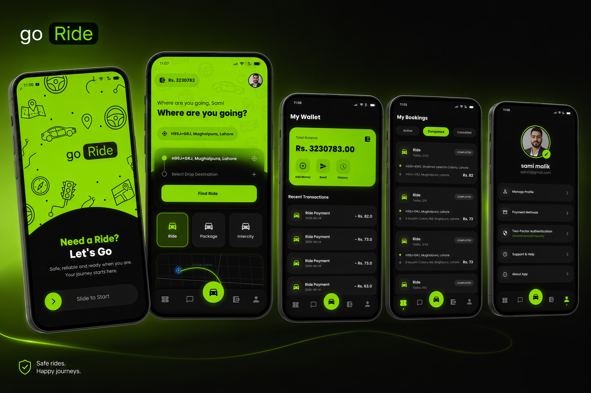
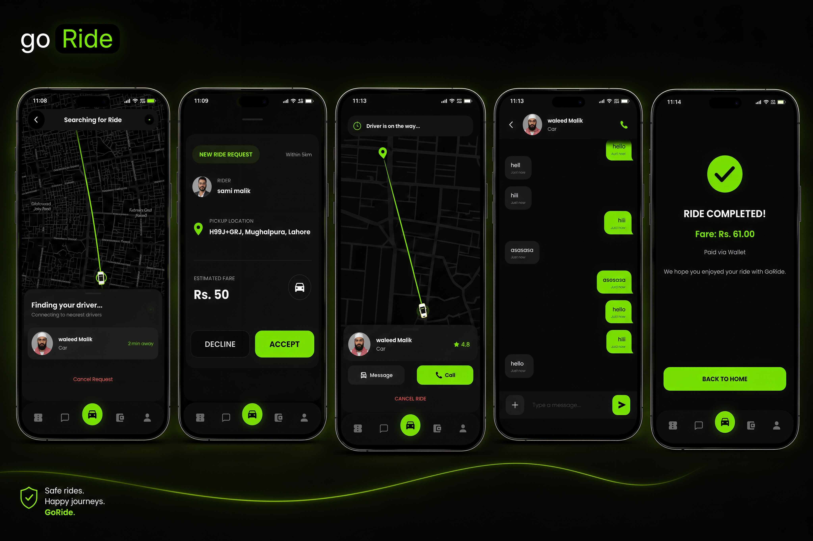
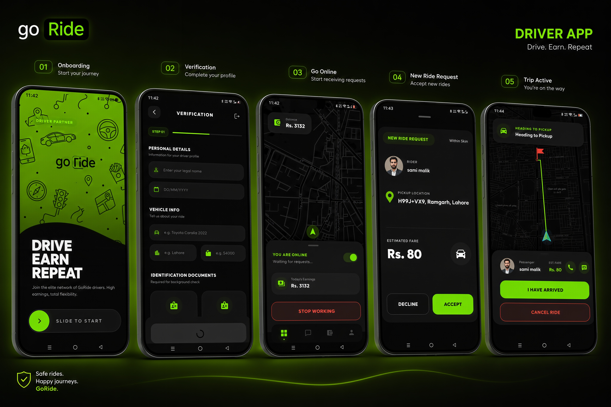
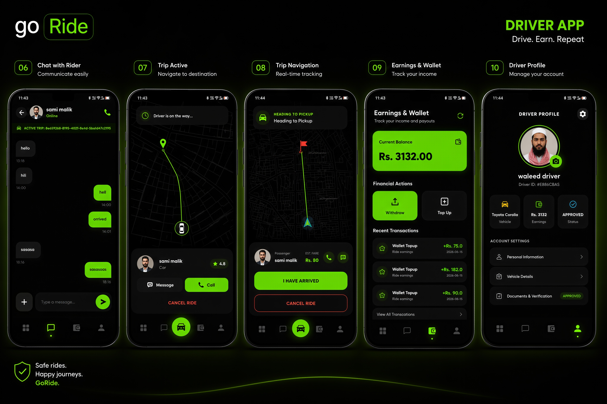

<div align="center">


<br />
<br />

<h1>GoRide</h1>

<p><strong>A full-stack, cross-platform ride-sharing and ride-hailing ecosystem built from scratch.</strong></p>

<p><em>Real-time matchmaking. Peer-to-peer calling. Atomic billing. Document-verified drivers.</em></p>

<br />

[Features](#features) • [Tech Stack](#tech-stack) • [Architecture](#architecture) • [Database Schema](#database-schema) • [Getting Started](#getting-started) • [Demo](#demo) • [Screenshots](#screenshots)

<br />

</div>

---

## Features

GoRide is a production-ready ride-hailing platform providing real-time geospatial driver matching, WebRTC peer-to-peer audio calling, ACID-compliant wallet transactions, and a document verification gate that ensures only approved drivers can go online.

| | Feature | Description |
|-|---------|-------------|
| | **Real-Time Driver Matching** | PostGIS spatial queries discover nearby online drivers within a configurable radius |
| | **Document Verification Gate** | Drivers cannot go online until CNIC, license, and vehicle docs are admin-verified |
| | **WebRTC Peer-to-Peer Calls** | Direct audio calls between rider and driver signaled over Socket.IO — no third-party TURN required |
| | **Atomic Wallet Billing** | Fare deduction, 80/20 driver payout, and ledger entries execute in a single PL/pgSQL transaction |
| | **Ride Lifecycle Management** | Full state machine from request → dispatch → acceptance → transit → completion |
| | **MFA & Secure Auth** | Supabase Auth with JWT, row-level security, and TOTP-based two-factor authentication |
| | **Persistent Messaging** | In-app chat between rider and driver with image support and read history |
| | **Push Notifications** | Firebase Cloud Messaging delivers ride alerts even when the app is backgrounded |

---

## Tech Stack

### Mobile Apps — Flutter

| Category | Technology |
|----------|------------|
| **Framework** | Flutter SDK `^3.11.5` |
| **State Management** | BLoC Pattern (`flutter_bloc: ^9.0.0`) |
| **Architecture** | Clean Architecture |
| **Mapping** | `flutter_map`, OpenStreetMap, `latlong2`, `geolocator`, `geocoding` |
| **Real-time** | Socket.IO client |
| **Calling** | WebRTC (`flutter_webrtc`) |
| **Auth** | Supabase Auth — JWT, TOTP MFA |

### Backend — Node.js

| Category | Technology |
|----------|------------|
| **Server** | Express.js |
| **Real-time Engine** | Socket.IO — rooms, location multicast, WebRTC signaling |
| **Database** | Supabase (PostgreSQL + PostGIS) |
| **Auth** | Supabase Auth with scoped client execution and RLS |
| **Push Notifications** | Firebase Admin SDK — Google FCM |
| **Architecture** | Routes → Middlewares → Controllers → Services |

---

## Architecture

The system is compartmentalized into three primary modules operating in unison:

```text
┌─────────────────────────────────────────────────────────────────────────────────┐
│                              GoRide Ecosystem                                   │
└─────────────────────────────────────────────────────────────────────────────────┘
        │                                         │
        ▼                                         ▼
┌──────────────────────────────┐        ┌──────────────────────────────┐
│        Rider Mobile App      │        │       Driver Mobile App      │
│  (Flutter / Clean Arch / BLoC│        │ (Flutter / Clean Arch / BLoC)│
└──────────────┬───────────────┘        └─────────────────┬────────────┘
               │                                          │
               │         HTTP REST / WebSockets / WebRTC  │
               └────────────────────┐ ┌───────────────────┘
                                    ▼ ▼
                        ┌──────────────────────────────┐
                        │      Node.js Backend API     │
                        │ (Express / Socket.IO / Admin)│
                        └───────────┬──────────────────┘
                                    │
               ┌────────────────────┴────────────────────┐
               ▼                                         ▼
┌──────────────────────────────┐        ┌──────────────────────────────┐
│     Supabase / Postgres      │        │    Firebase Cloud Messaging  │
│ (Tables / PostGIS / RPCs)    │        │    (Push Notifications)      │
└──────────────────────────────┘        └──────────────────────────────┘
```

### Ride Lifecycle Flow

```
Client /rides/request
        │
        ▼
get_nearby_drivers (PostGIS RPC)
        │
        ▼
ride_request socket event + FCM push → Driver
        │
        ▼
Driver /rides/accept → room: driver_assigned
        │
        ▼
Passenger /rides/confirm → state: accepted
        │
        ▼
driver_arrived → started → complete
        │
        ▼
complete_ride_transaction (PL/pgSQL — atomic fare + payout + ledger)
```

---

## Database Schema

| Table | Description |
|-------|-------------|
| `profiles` | Universal user records, wallet balance, FCM token, account type |
| `drivers` | License data, vehicle info, document URLs, verification status, live location |
| `rides` | Full ride audit — coords, fare, status, timestamps |
| `messages` | Persistent rider-driver chat with image support |
| `transactions` | Immutable financial ledger — credits, debits, ride payments, payouts |

### Driver Verification States

```
Document Submission → pending → (Admin Review) → approved / rejected
                                                        │
                                                   is_online = true (only if approved)
```

---

## Stored Procedures (RPC)

| Function | Description |
|----------|-------------|
| `complete_ride_transaction` | Atomic fare deduction, 80% driver payout, 20% platform cut, ledger entries |
| `topup_wallet` | Increments wallet balance and records credit transaction |
| `request_payout` | Validates balance, decrements, stages withdrawal — raises exception if insufficient |
| `get_nearby_drivers` | PostGIS `ST_Distance` filter on online drivers within radius |
| `get_user_conversations` | De-duplicated conversation list with latest message previews |

---

## Getting Started

### Prerequisites

- [Node.js](https://nodejs.org/) `>=18.x`
- [Flutter SDK](https://flutter.dev/) `^3.11.5`
- Active [Supabase](https://supabase.com/) project with PostGIS enabled
- Firebase project with Android/iOS apps configured

---

### 1. Clone the Repository

```bash
git clone https://github.com/your-username/goride.git
cd goride
```

---

### 2. Backend Setup

```bash
cd goride_backend
npm install
```

Create a `.env` file inside `/goride_backend`:

```env
PORT=3000

SUPABASE_URL=https://your-project-id.supabase.co
SUPABASE_ANON_KEY=your-supabase-anon-key
SUPABASE_SERVICE_ROLE_KEY=your-supabase-service-role-key

```

Place your Firebase Admin service account file at:

```
goride_backend/firebase-service-account.json
```

Start the server:

```bash
npm run dev
```

> Server runs at `http://0.0.0.0:3000`

---

### 3. Rider App Setup

```bash
cd goride_app
flutter pub get
flutter run -d <target-device-id>
```

---

### 4. Driver App Setup

```bash
cd goride_driver_app
flutter pub get
flutter run -d <target-device-id>
```

---

## Demo

### Full App Walkthrough

<div align="center">
  <a href="https://youtu.be/y0LuTJVEeBY?si=Zrt9AfphDwdzlqr0">
    
  </a>
  <p><b>Click to watch the complete feature demonstration</b></p>
  <p><i>Rider flow, driver flow, real-time matching, WebRTC calls, wallet billing, and document verification — all in action.</i></p>
</div>

---

## Screenshots

### Passenger App

<p align="center">
  
</p>

<p align="center">
  
</p>

### Driver App

<p align="center">
  
</p>

<p align="center">
  
</p>

---


## License

Distributed under the MIT License. See [`LICENSE`](LICENSE) for details.

---

<div align="center">

Built from scratch. Architected with intent. Shipped with care.

If this helped you, drop a star — it means a lot.

</div>
